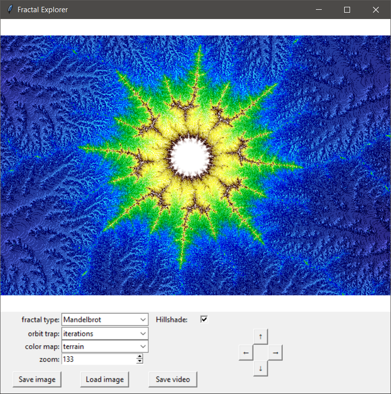

# Fractal Explorer

This repository contains a GUI for visual exploration of fractals.

Current capabilities include:

- adjustment of applied colormap
- navigation (up, down, left, right) and zooming
- saving images
- loading position/colormap from previously saved images

As navigation occurs, the fractal image is dynamically recomputed using the CUDA architecture.

Future improvements include:

- addition of more fractal systems
- option to adjust orbit trap used for coloring
- image-based orbit trapping

## Requirements

- Python 3.x
- an Nvidia GPU with CUDA Python installed. 

## Installation and Usage
1. Ensure your computer is equipped with an Nvidia GPU.
2. Install [CUDA](https://developer.nvidia.com/cuda-toolkit).
3. Install [Python CUDA packages](https://developer.nvidia.com/how-to-cuda-python) (in a conda environment: `conda install numba cudatoolkit=9.0 pyculib`).
4. Run the `fractal_explorer.py` script in this repository and have fun!

Images created using the `Save image` button are saved to an \images\ directory in this repository. Upon saving, the output filename is also printed to the console. 

Loading a previously saved image with the `Load` button will reset the window location and colormap according to the loaded image.
